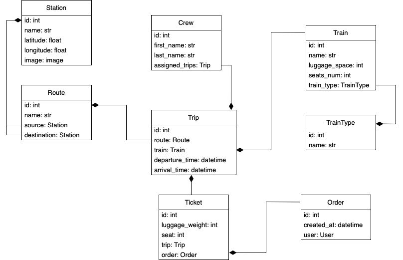

# Train Station API

### Description
Provides an easy yet versatile administrations of a train station. 
Has Order system with ticket validation.
Supports flexible Station/Route/Trips and Crew management. 

### DB Diagram:

### Endpoints:
- station/train-types/
- station/trains/
- station/stations/
- station/routes/
- station/crews/
- station/orders/
- station/trips/
- station/tickets/

Detail information on each endpoint available on _**doc/swagger/**_ or _**doc/redoc/**_

### Features:
* JWT Authentication
* Routes and Trips filtering
* Ticket validation
* Trip validation
* User model has been changed, so email is used instead of username